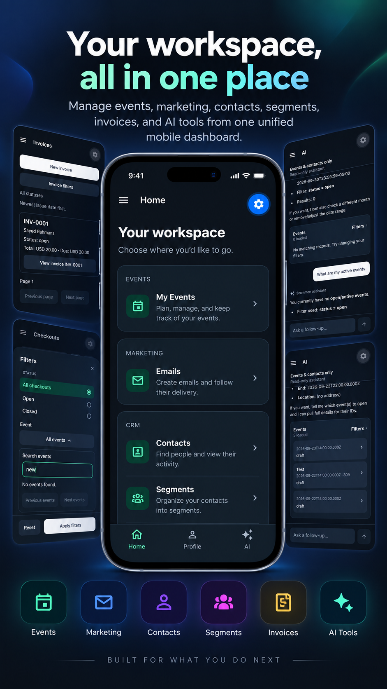
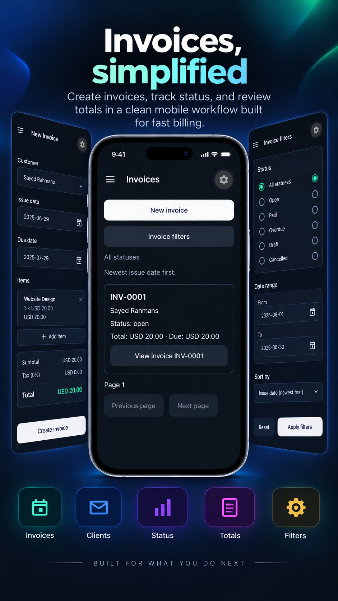
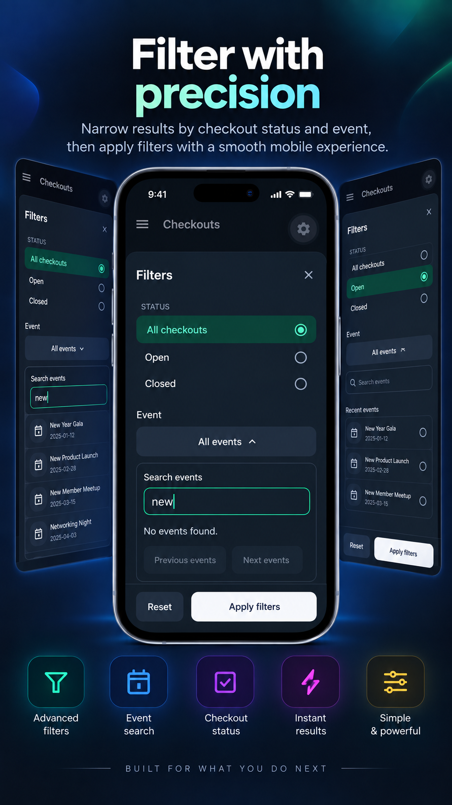
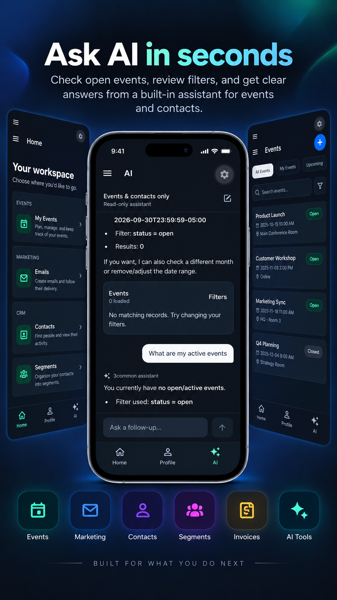
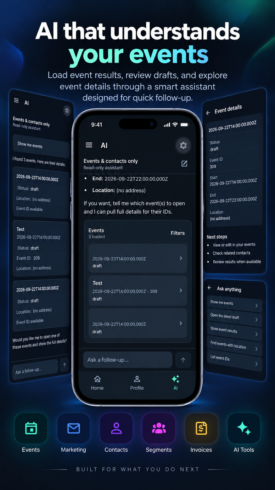

# 3common

A mobile workspace for managing events, contacts, audience segments, email campaigns, checkouts, invoices, and orders in one place, with an AI assistant for exploring events and contacts.

## Screenshots

App showcase images. Select an image to view it at full size.

<p align="center">
  <a href="assets/screenshots/1.png"></a>
  <a href="assets/screenshots/2.png"></a>
  <a href="assets/screenshots/3.png"></a>
  <a href="assets/screenshots/4.png"></a>
  <a href="assets/screenshots/5.png"></a>
</p>

## Features

- **Events:** browse, filter, view details, and edit events.
- **CRM:** manage contacts, review activity, and organize audience segments.
- **Email marketing:** create and edit campaigns, build email content, and review delivery activity.
- **Commerce and finance:** browse checkouts and orders, create and edit invoices, and filter records.
- **AI assistant:** ask questions about events and contacts, refine results with follow-up messages, and explore matching records. The assistant cannot modify business records.
- **Appearance:** navigate your workspace in light or dark mode.

The app is under active development. Some screens are still in progress. You need a valid 3common API key with permission to access the records you want to manage.

## Install and run

You need Git, Node.js 24, npm, and a valid 3common API key.

```sh
git clone https://github.com/sayedsamin/3common-app.git
cd 3common-app
npm ci
```

### Create .env.local

Copy the example file in the project root.

**Windows PowerShell:**

```powershell
Copy-Item .env.example .env.local
```

**macOS / Linux:**

```sh
cp .env.example .env.local
```

Edit `.env.local`:

```dotenv
EXPO_PUBLIC_API_URL=https://api.3common.com/v1/
EXPO_PUBLIC_AI_URL=
EXPO_PUBLIC_SENTRY_DSN=
```

Set `EXPO_PUBLIC_AI_URL` to your deployed assistant backend URL, or an endpoint provided by the maintainer. Leave it blank to run without the AI assistant. Sentry is optional and can stay blank. See the [assistant backend instructions](backend/ai/README.md) if you want to host it yourself.

Enter your **3common API key in the app's sign-in screen**, not in this file. Keep `.env.local` untracked; all `EXPO_PUBLIC_*` values are public client configuration. Restart the development server after changing them.

### Run with Expo Go

Install an Expo Go version compatible with **Expo SDK 57** on your phone, then run:

```sh
npx expo start --go
```

Keep your phone and computer on the same Wi-Fi network and scan the terminal's QR code with Expo Go on Android or the Camera app on iOS. If Expo Go on iOS requests an account match, run `npx expo login` and sign in to the same account in Expo Go.

Use `--go` explicitly: this project's `npm start` command targets a development build. Expo Go device behavior has not been verified for this project; use the native build commands below if you encounter an unsupported native module. See [Expo's launch-target documentation](https://docs.expo.dev/more/expo-cli/#launch-target).

### Run in a browser

```sh
npm run web
```

### Build and run locally

**Android:** install Android Studio and configure an emulator, then run:

```sh
npm run android
```

For a connected Android phone with USB debugging enabled:

```sh
npm run android -- --device
```

**iOS:** on macOS with Xcode and an iOS Simulator installed, run:

```sh
npm run ios
```

These commands compile and install a development build and start the server. On later runs, start the server with:

```sh
npm start
```

### Build an Android APK with EAS

Install the EAS CLI and sign in:

```sh
npm install --global eas-cli
eas login
```

If you are building your own copy, remove the existing `owner` and `extra.eas.projectId` from `app.config.ts`, then link your own Expo project:

```sh
eas init
```

If EAS prints a configuration snippet, copy its new project ID into `extra.eas.projectId` in `app.config.ts` and set `owner` to your Expo account or team. Choose your own `android.package` and `ios.bundleIdentifier` if you intend to publish your own app.

For AI support, add `EXPO_PUBLIC_AI_URL` to your project's **preview** environment in the Expo dashboard. Cloud builds do not receive your ignored `.env.local` file.

```sh
eas build --platform android --profile preview
```

Follow the signing prompts, then download and install the APK from the completed build link. This APK runs without Expo Go or a development server.

## Start using the app

Open the app and enter your 3common API key. Use **Home** to access your workspace, **AI** to explore events and contacts when configured, and **Settings** to sign out. An internet connection is required to load and update your data.
